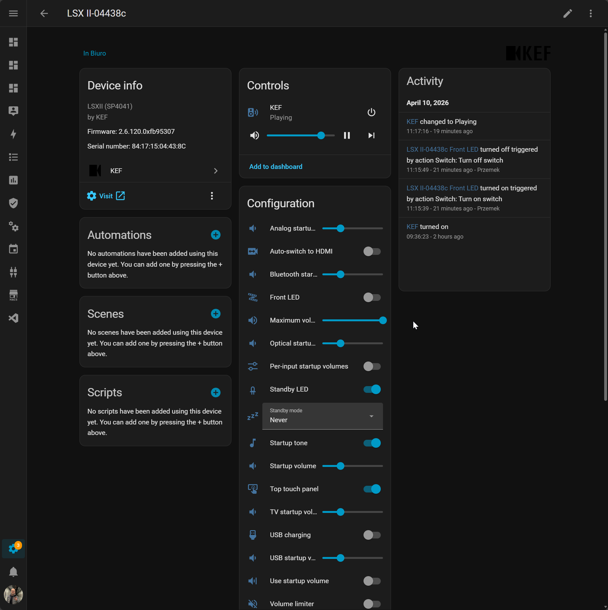

# KEF for Home Assistant

[](https://hacs.xyz/)
[](https://github.com/EvotecIT/homeassistant-kef/actions/workflows/validate.yml)
[](https://github.com/EvotecIT/homeassistant-kef/actions/workflows/hassfest.yml)

Local-first KEF support for Home Assistant, built to support both newer KEF speakers and older generations in one integration.



## 🎯 What This Is

This project is a custom KEF integration for Home Assistant with a strong bias toward:

- local control
- clean Home Assistant setup
- no dependency on external KEF transport libraries
- one codebase for modern and legacy KEF families

## 🔊 Device Support Direction

### Modern KEF family

The most mature support today is for speakers using KEF's newer local HTTP API, including:

- LSX II
- LSX II LT
- LS50 Wireless II
- LS60
- XIO

### Older KEF family

Older first-generation KEF speakers matter too. This repo already includes a separate legacy transport path so the integration can support earlier LSX / LS50 Wireless-style devices without forcing them through the newer API model.

Current live validation is strongest on LSX II, but broad KEF coverage is the goal, not just the newest models.

## ✨ What You Get

- zeroconf discovery and UI setup
- media player controls
- source selection
- volume and mute
- startup-volume controls
- standby and wake-source settings
- LED and hardware behavior controls where supported
- optional diagnostics

## 🏠 Installation

### HACS

1. Open HACS.
2. Add `https://github.com/EvotecIT/homeassistant-kef` as a custom repository of type `Integration`.
3. Install `KEF`.
4. Restart Home Assistant.
5. Go to `Settings -> Devices & services` and add `KEF`.

### Manual

1. Copy the `custom_components/kef` folder into your Home Assistant `config/custom_components` directory.
2. Restart Home Assistant.
3. Add the integration from `Settings -> Devices & services`.

## ✅ Current Status

- strongest real-device validation today: LSX II
- modern KEF support is already practical and expanding
- legacy KEF support is part of the design, not an afterthought
- compatibility is handled by transport and capability detection, not just hardcoded firmware guesses

The current LSX II investigation notes are in `docs/kef-lsx2-investigation.md`.

## 🧱 Project Structure

This repo is intentionally split into two layers:

- a reusable Python protocol/client layer for KEF local APIs
- the Home Assistant integration layer built on top of it

That makes it easier to support both modern and older KEF devices and leaves room to extract a standalone Python library later if the protocol layer matures enough.

## 🛣️ Roadmap

- improve older KEF coverage and real-device validation
- keep extending modern KEF settings safely
- expose capabilities based on what the speaker really supports
- continue cleaning up entity presentation for the best Home Assistant experience

## 🛠️ Development

```bash
python -m pip install -e .[test]
ruff check .
python -m compileall custom_components tests
pytest
```

Note:

- the full Home Assistant pytest stack runs best in Linux CI
- on Windows, `pytest-homeassistant-custom-component` imports `fcntl`, so complete local HA pytest runs are limited

## ❤️ Support

- Issues: [GitHub Issues](https://github.com/EvotecIT/homeassistant-kef/issues)
- Source: [GitHub Repository](https://github.com/EvotecIT/homeassistant-kef)
