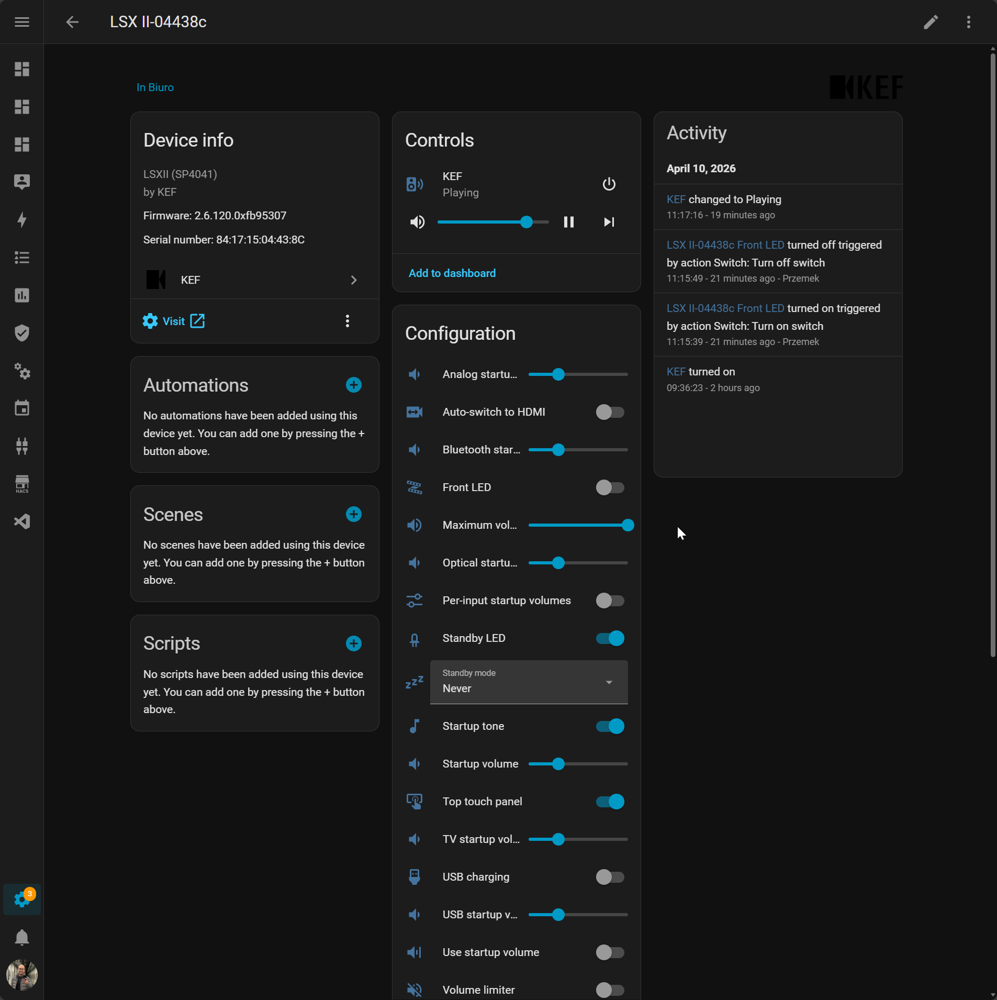

# KEF for Home Assistant

[](https://hacs.xyz/)
[](https://github.com/EvotecIT/homeassistant-kef/actions/workflows/validate.yml)
[](https://github.com/EvotecIT/homeassistant-kef/actions/workflows/hassfest.yml)

Local-first KEF support for Home Assistant, built to support both newer KEF speakers and older generations in one integration.



## More from Evotec

This project is part of our Home Assistant family:
[Dreame Lawn Mower](https://github.com/EvotecIT/homeassistant-dreamelawnmower),
[Lawn Mower Card](https://github.com/EvotecIT/lovelace-lawn-mower-card),
[Siegenia](https://github.com/EvotecIT/homeassistant-siegenia),
[KEF](https://github.com/EvotecIT/homeassistant-kef),
[Devialet](https://github.com/EvotecIT/homeassistant-devialet), and
[EasyControlX](https://github.com/EvotecIT/homeassistant-easycontrolx).

For a native Apple companion,
[CasaRay](https://casaray.dev/) ([App Store](https://apps.apple.com/us/app/casaray/id6778025328))
offers a calm whole-home view on iPhone, iPad, and Mac, while
[Tactra Remote](https://tactra.dev/) ([App Store](https://apps.apple.com/us/app/tactra-remote/id6775426723))
focuses on Home Assistant media control across iPhone, iPad, Apple Watch, and
Mac.

CasaRay's complete-home Free experience remains genuinely useful. CasaRay Plus
and Tactra purchases help fund continued work on that free experience and these
open-source Home Assistant projects. If you prefer to support the open-source
work directly, [GitHub Sponsors](https://github.com/sponsors/PrzemyslawKlys) is
another option. None of them is required to use this project.

## 🎯 What This Is

This project is a custom KEF integration for Home Assistant with a strong bias toward:

- local control
- clean Home Assistant setup
- no dependency on external KEF transport libraries
- one codebase for modern and legacy KEF families

## 🔊 Device Support Direction

### Modern KEF family

The most mature support today is for speakers using KEF's newer local HTTP API, including:

- LSX II
- LSX II LT
- LS50 Wireless II
- LS60
- XIO

### Older KEF family

Older first-generation KEF speakers matter too. This repo already includes a separate legacy transport path so the integration can support earlier LSX / LS50 Wireless-style devices without forcing them through the newer API model.

Current live validation is strongest on LSX II, but broad KEF coverage is the goal, not just the newest models.

## ✨ What You Get

- zeroconf discovery and UI setup
- media player controls
- source selection
- volume and mute
- source-aware playback controls on modern KEF sources
- startup-volume controls
- standby and wake-source settings
- LED and hardware behavior controls where supported
- privacy, streaming-quality, and regional settings where supported
- event-assisted refresh on modern KEF speakers
- optional diagnostics

## 🏠 Installation

### HACS

Click the button below to open this repository inside HACS. If the button does not open your Home Assistant instance, add `https://github.com/EvotecIT/homeassistant-kef` manually as a custom repository of type `Integration`.

[](https://my.home-assistant.io/redirect/hacs_repository/?owner=EvotecIT&repository=homeassistant-kef&category=integration)

1. Download `KEF` from HACS.
2. Restart Home Assistant.
3. Add the integration from `Settings -> Devices & services`, or use the button below.

[](https://my.home-assistant.io/redirect/config_flow_start/?domain=kef)

### Manual

1. Copy the `custom_components/kef` folder into your Home Assistant `config/custom_components` directory.
2. Restart Home Assistant.
3. Add the integration from `Settings -> Devices & services`.

### KEF Web UI Passwords

Recent KEF firmware can require a password for the speaker web interface and
local API writes. If your speaker has web UI password protection enabled, enter
that password when adding or reconfiguring the integration. If the speaker starts
requiring a password after a firmware update, Home Assistant will ask you to
reauthenticate the KEF integration.

## ✅ Current Status

- strongest real-device validation today: LSX II
- modern KEF support is already practical and expanding, including event-assisted refresh on LSX II-era devices
- firmware updates are exposed through the update entity, with `kef.install_firmware_file` for local `.swu` uploads
- legacy KEF support is part of the design, not an afterthought
- compatibility is handled by transport and capability detection, not just hardcoded firmware guesses

The current LSX II investigation notes are in `docs/kef-lsx2-investigation.md`.

Feature tracking checklist: `docs/feature-checklist.md`

## 🧱 Reusable Python Package

This repository now ships two usable layers:

- `kef_client` for direct Python access to KEF local APIs
- the Home Assistant integration in `custom_components/kef`

Library docs: `docs/python-library.md`

Runnable example: `examples/python_client.py`

Example:

```python
from aiohttp import ClientSession
from kef_client import ModernKefClient

async with ClientSession() as session:
    client = ModernKefClient("192.168.1.20", session)
    snapshot = await client.async_refresh()
    print(snapshot.device.device_name, snapshot.source)
```

That keeps the protocol layer reusable for scripts and apps while the integration stays focused on Home Assistant setup and entities.

## 🛣️ Roadmap

- next tracked work lives in `docs/feature-checklist.md`
- top priorities are older-device validation, newer firmware auth/password coverage, and continued capability polishing
- the long-term direction remains one integration with strong modern and legacy support

## 🛠️ Development

```bash
python -m pip install -e .[test]
ruff check .
python -m compileall kef_client custom_components tests examples
pytest
```

Note:

- the full Home Assistant pytest stack runs best in Linux CI
- on Windows, `pytest-homeassistant-custom-component` imports `fcntl`, so complete local HA pytest runs are limited

## ❤️ Support

- Issues: [GitHub Issues](https://github.com/EvotecIT/homeassistant-kef/issues)
- Source: [GitHub Repository](https://github.com/EvotecIT/homeassistant-kef)
