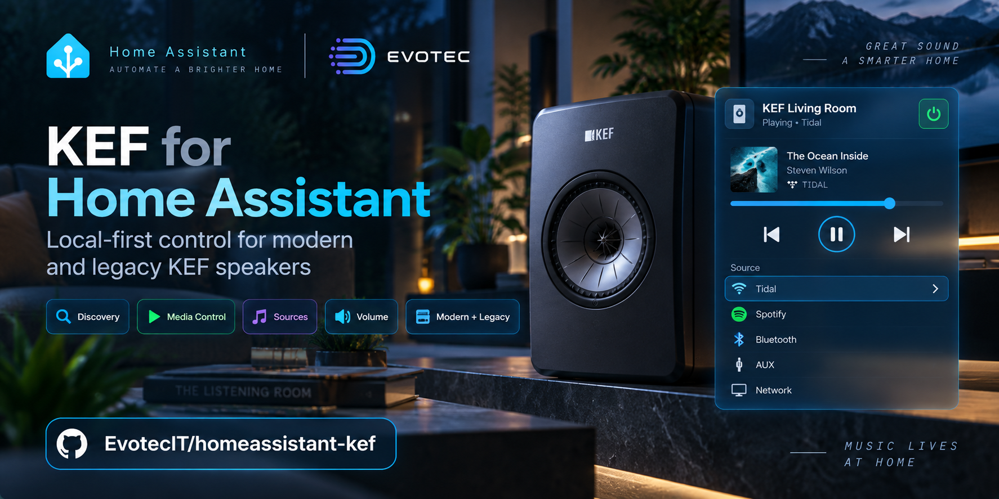

# KEF for Home Assistant

## Overview

Control KEF speakers over your local network from Home Assistant. The
integration brings together modern and first-generation speaker families with
discovery, a media player, and the settings each device exposes.

- Volume, mute, source selection, and supported playback controls.
- Startup volume, standby, wake sources, LEDs, and other supported device settings.
- Firmware update controls and optional diagnostics.

LSX II has the strongest real-device validation. LSX II LT, LS50 Wireless II,
LS60, and XIO are modern-API compatibility targets; first-generation LSX and
LS50 Wireless use a separate legacy connection. Check the
[device support guide](docs/device-support.md) for the evidence and limitations.

## Sponsor

Support development and maintenance through
[GitHub Sponsors](https://github.com/sponsors/PrzemyslawKlys).
Sponsorship is optional; these projects remain open source.

## More for your Home Assistant home

Other integrations and dashboards we maintain:

- [Dreame & MOVA mowers](https://github.com/EvotecIT/homeassistant-dreamelawnmower) — Mowing controls, maps, schedules, and supported cameras.
- [Lawn Mower Card](https://github.com/EvotecIT/lovelace-lawn-mower-card) — A dashboard for mower state, maps, and controls.
- [Devialet](https://github.com/EvotecIT/homeassistant-devialet) — Local speaker control, with Dione support.
- [Siegenia](https://github.com/EvotecIT/homeassistant-siegenia) — Local control for supported window controllers.
- [EasyControlX](https://github.com/EvotecIT/homeassistant-easycontrolx) — Connect supported Windows and macOS hosts.

For a native app connected to the same Home Assistant setup:

- [CasaRay](https://casaray.dev/) — rooms, devices, cameras, and home activity on
  iPhone, iPad, and Mac.
- [Tactra Remote](https://tactra.dev/) — media players, speakers, and TV controls
  on iPhone, iPad, Apple Watch, and Mac.

Neither app is required to use this project.

## Installation

### HACS

1. Open the repository with the button above. Alternatively, in HACS choose
   **Custom repositories**, add `https://github.com/EvotecIT/homeassistant-kef`,
   and select **Integration**.
2. Download **KEF** and restart Home Assistant.
3. Open **Settings → Devices & services → Add integration**, then choose
   **KEF**.

### Manual

1. Download the repository and copy `custom_components/kef` into your
   Home Assistant `config/custom_components` directory.
2. Restart Home Assistant.
3. Add **KEF** from **Settings → Devices & services**.

## Configuration

Accept a discovered speaker or enter its host/IP address. If the speaker's web
interface is password-protected, enter that password during setup. A later
firmware change may require reauthentication.

Open the speaker's device page to use its media player and supported settings.
Use **Configure** to adjust polling and diagnostic options; use **Reconfigure**
if its network address changes.

## Documentation

| I want to… | Guide |
| --- | --- |
| Check modern and legacy model support | [Device support](docs/device-support.md) |
| Configure the speaker, password, or settings | [Configuration and troubleshooting](docs/configuration.md) |
| Add playback or volume automations | [Automations](docs/automations.md) |
| Use KEF from Python | [Python library](docs/python-library.md) |
| Contribute or investigate a device | [Development](docs/development.md) · [Feature checklist](docs/feature-checklist.md) |

## Screenshots

## Support

[Report an issue](https://github.com/EvotecIT/homeassistant-kef/issues) with the
speaker model, firmware, integration version, and steps to reproduce. Download
integration diagnostics and review attachments before posting. Never include
the speaker password or other credentials.
